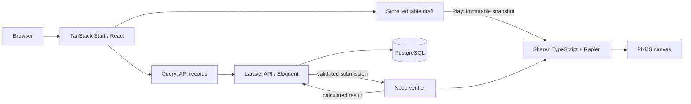

# Architecture and decisions

Status: agreed direction; implementation status is tracked separately in development.md.

## Stack ownership

| Component | Owns |
| --- | --- |
| Laravel API / Eloquent | Authentication, authorization, validation, business rules, persistence, publication, verification orchestration, rankings |
| PostgreSQL | Durable application data; accessed through Laravel |
| TanStack Start / React / Router | SSR website, navigation, editor UI and server-side API reads |
| TanStack Query | API data fetching, caching and mutations |
| TanStack Store | Client draft, selection, active tool, editing history and coarse run status |
| PixiJS | Canvas rendering, camera and canvas input |
| Rapier 2D | Physics bodies, collisions and constraints |
| Shared TypeScript simulation | Ordered construction, ticks, part behaviours, goals and score calculation |
| Node verifier | Bounded headless execution of that shared simulation |

Do not add Django or direct PostgreSQL access to Start. Start server functions may adapt requests but must not duplicate Laravel business rules. React and Store do not receive every physics-body update.

## Repository layout

```text
apps/web/           TanStack Start application
apps/api/           Laravel API
apps/verifier/      headless verification entrypoint
packages/simulation/ browser-independent TypeScript and Rapier
packages/contracts/ versioned puzzle schemas and TypeScript types
docs/               product, architecture, contracts, development
infra/              local infrastructure configuration
```

One repository, pnpm workspace for JavaScript packages, Composer lockfile for Laravel. Pin exact simulation dependencies and retain lockfiles. Do not upgrade physics as routine maintenance without compatibility validation.



The diagram describes the target architecture. Current scaffold boundaries exist, but draft editing, authentication and submission verification are not yet implemented.

## Request and authentication design

Prefer one browser-facing origin. Reverse proxy /api/* and /sanctum/* to Laravel; other paths to Start. Laravel owns session cookies and CSRF enforcement. SSR calls use an internal API origin and explicitly forward only required authentication headers. Never put privileged tokens in browser bundles. Query clients must be per SSR request, not a global cache shared across users.

Authentication and the reverse proxy are milestones to implement and test. Public health checks can be built first. Browser API access uses relative paths; server API access uses an environment variable. Avoid adding two independent login/session systems.

## Data model

- users: Laravel account ownership.
- creations: editable owner-controlled record, title, draft JSON, revision for optimistic concurrency, optional remix origin.
- puzzle_versions: immutable published document, inventory, locked parts, goal, schema version, simulation version, content hash.
- submissions: authenticated user, puzzle version, bounded starting arrangement, status and idempotency key.
- verification_results: calculated completion tick, part count, simulation version and diagnostic digest; failures never earn a score.

Store draft documents in JSONB; retain relational keys and indexes for ownership and listing. A published version is never overwritten by later edits. Saving with a stale revision returns a conflict instead of silently replacing another edit.

## Verification trust boundary

Browser scores are provisional. Laravel validates document shape, ownership, immutable locked objects, inventory and placement rules before queueing. The verifier loads a server-owned puzzle version plus the submitted placement; it does not trust submitted scenery, goals, score, executable code or simulation version.

Jobs have maximum payload, parts, joints, ticks, wall time and memory. Start with one isolated process per job and modest concurrency. Retry idempotently; only Laravel records accepted rankings. Communication transport is an implementation decision: Laravel may invoke a bounded worker process initially, with a queue-backed worker later.

## Determinism contract

Use a fresh world per run, fixed 1/60 second timestep, stable IDs and sorted construction/event processing order. No wall-clock timing, unseeded randomness or render-frame-derived input in game rules. Avoid platform-sensitive transcendental calculations when producing physics inputs. Quantize authoring inputs to documented units before saving. Camera and CSS pixels never change world geometry.

Record schemaVersion and simulationVersion. The latter identifies Rapier version, simulation code and configuration. Same inputs on the same supported simulation version must agree across intended browsers and verifier. Upgrades require a new version and an explicit old-version support strategy.

Validation: per-tick state digests over repeated runs, fresh resets, varying render schedules, Chromium/Firefox/WebKit and Node. Same-host tests are an initial gate, not proof of cross-platform determinism. Maintain golden fixtures and investigate changed results before accepting new versions.

## Sources consulted

- https://tanstack.com/start/latest/docs/framework/react/build-from-scratch
- https://tanstack.com/start/latest/docs/framework/react/guide/selective-ssr
- https://rapier.rs/docs/user_guides/javascript/determinism/
- https://laravel.com/docs/13.x/installation

Package versions and actual compatibility must be checked during installation; these documents describe the intended design, not completed features.
