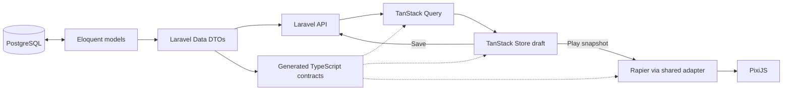

# Framework ownership and lifecycle

Status: accepted. Governing constraint: **Only glue code and product rules.**

## Framework mapping

| Responsibility | Existing capability to use | Glue/product code permitted |
| --- | --- | --- |
| Tables, relations, transactions | Laravel migrations, Eloquent, PostgreSQL constraints | Column types/nullability, primary/unique keys and foreign keys; release/save transactions |
| Authorization | Laravel policies and middleware | Ownership and publication permissions |
| Authentication, later | Laravel Fortify + Sanctum session authentication | UI, same-origin forwarding and standard CSRF handling |
| PHP data shape / JSONB casting | Spatie Laravel Data | Named DTOs, validation attributes and cross-field product rules |
| TypeScript data contracts | Spatie TypeScript Transformer | Generator configuration; no handwritten duplicate interfaces |
| Laravel API route helpers | Laravel Wayfinder | Generator configuration and a small fetch adapter |
| Page navigation / SSR | TanStack Start + Router | Routes and page composition |
| Fetch/cache/mutations | TanStack Query | Query keys, query options and save mutation behaviour |
| Editing subscriptions | TanStack Store | Per-editor state and feature-specific edit actions |
| Local draft persistence | Native localStorage / JSON / structuredClone | Save/load envelope, errors and bounded history |
| Canvas and input | PixiJS | Part visual factory, pointer-to-world conversion |
| Collision, gravity, integration | Rapier 2D | Explicit supported shape/material construction |
| Tick/goal semantics | Shared TypeScript module | Fixed-step orchestration, deterministic order, success test |
| Background verification, later | Laravel queue/jobs + Symfony Process | Bounded invocation of shared Node simulation and result validation |
| Rankings, later | Eloquent/PostgreSQL queries; TanStack Table/Charts as needed | Score ordering and display |

Do not add Inertia: Start/Router already own frontend navigation. Wayfinder describes Laravel API routes; it does not replace TanStack Router. Do not add Django, a second auth owner, a TypeScript database connection, a generic repository layer over Eloquent, a custom schema compiler or a custom game engine.

The tools do not remove product work. Transform constraints, release immutability, fixed scenery, inventory and replay validation are genuine product rules.

The Save arrow is the later authenticated cloud path. The first slice saves a local draft through native browser storage. Laravel never receives per-frame updates.

## Repository boundaries

Frontend convention: route modules render named screens in `apps/web/src/features/<feature>`. Reusable site components live in `src/components`; original basketball/brick SVGs live in `public/assets/parts` and are shared by React previews and Pixi sprites. `PartArtwork` explicitly maps visual keys. Artwork bounds align to the collider silhouette, with centred anchors and dimensions supplied by the catalogue. Decorative shadows belong to presentation outside the assets. The welcome screen and `/prototype` use this convention; the prototype is a dedicated test and does not populate the empty sandbox starter.

- apps/api: authoritative Eloquent models, DTOs, enums, policies, controllers, seeders and application actions.
- packages/contracts: generated TypeScript DTO/enumeration definitions. No competing manually maintained puzzle schema.
- apps/web/src/generated: Wayfinder output only; contains transport helpers, not game data.
- apps/web: React/Start pages, Query configuration, Store draft, localStorage adapter, PixiJS presentation.
- packages/simulation: Rapier adapter and product simulation rules. Receives a resolved catalogue and validated document as inputs. Imports contract types, not HTTP/React/DOM.
- apps/verifier: Node entrypoint for the same package. Existing smoke runner is not yet a submission verifier.
- docs: normative design and implementation handoff.

Spatie Laravel Data, TypeScript Transformer, Wayfinder, Fortify and Sanctum are selected but not installed in the current scaffold. Implementation must confirm mutually compatible releases with the existing Laravel/PHP versions and pin them. Do not upgrade the entire stack to add them.

## Contract generation across containers

PHP contracts are the source. Generate from the API container into the shared workspace before web typecheck/build. Use Wayfinder's Artisan generator with an explicit output directory; do not ask the Node-only Vite container to run PHP and do not mount the Docker socket into it.

Add one root development command that runs the packages' generators in order. Use their existing CLIs/watch support, not a custom file watcher. Clear stale Laravel route cache before generation. Initially explicit regeneration after PHP contract changes is sufficient.

Commit generated contract and Wayfinder outputs so frontend contributors can inspect them. Never hand-edit them. CI regenerates from a fresh checkout and fails on a diff, then builds/types checks. Generated paths must not contain workstation-dependent paths, origins or secrets. Preserve internal package files the generators require.

Wayfinder returns URL/method helpers; Spatie supplies payload/response types. Fetch makes the request; Query manages its lifecycle. A typed fetch return is not runtime validation.

## Validation ownership

Laravel Data supplies structural types and ordinary validation through Laravel's validator. Add domain rules for catalogue membership, supported shape fields, limits, immutable scenery and inventory. Use explicit validation for requests, local-draft restoration and seed imports: constructing a DTO or casting an Eloquent attribute is not itself proof that validation ran.

Catalogue DTO rules own supported visual/recipe/body/shape identifiers, shape-dependent dimensions, dynamic mass and coefficient bounds. Ordinary catalogue model saves reuse these rules before persistence, validating raw values before casts can round or coerce them. The importer validates the complete definition and release sealing validates completeness again. PostgreSQL retains relational integrity and uniqueness; do not duplicate catalogue product rules in CHECK constraints. Bulk SQL/Eloquent query-builder writes bypass this validation and the release guards and are not supported catalogue-maintenance paths.

Use enum/attribute/rule capabilities before custom validators. Reject unsupported/unknown payload keys with explicit allowed-key rules. Do not build a second generic validation schema in TypeScript. UI constraints improve feedback; Laravel remains authoritative.

For the first slice, restoring a local document calls a stateless guest validation endpoint before it can run. This avoids a duplicated runtime validator. It requires the API to be reachable; local save does not promise offline operation. The simulation still checks supported recipe/shape IDs and refuses invalid numerical inputs as a small boundary guard.

## Load, edit, run, save

| Step | Owner and behaviour |
| --- | --- |
| Load catalogue | Query retrieves a released catalogue DTO; cache by exact release key, never substitute latest |
| Load creation | Query retrieves a DTO; validate before copying its document into a Store created for this editor |
| Edit | Store holds draft, dirty state, selection and history; mutate through small feature actions |
| Play | Freeze/clone current validated draft; construct a new Rapier world from document + exact catalogue |
| Render | PixiJS reads transforms; React/Store receive coarse status, not every body transform |
| Pause | Stop stepping; no wall-time accumulation while paused |
| Reset | Free world, return to existing draft; do not reconstruct the draft from physics output |
| Local save | Write a versioned JSON envelope; catch quota/storage errors; never claim success on failure |
| Cloud save, later | Send expectedRevision + DTO through Wayfinder/fetch/Query; Laravel authorizes, validates and atomically increments revision |
| Save response | Query caches accepted server result; clear dirty only if current draft is still the submitted draft |
| Publish, later | Laravel validates and freezes a new publication; verified solution required for ranked puzzle |
| Submit, later | Laravel loads authoritative publication/catalogue, validates player placements and queues independent replay |

Clear body handles at reset; selection uses document instance IDs, not Rapier handles. A catalogue update notification may offer an explicit new draft; it must not mutate an open machine.

## HTTP and SSR

Keep one browser-facing origin. Browser API requests use relative paths. Current Vite proxy serves /api and /sanctum; when authentication arrives also proxy the selected Fortify endpoints. Server-side reads use an internal API origin and forward only necessary cookies/headers. Do not expose internal origin in browser config. State-changing SSR proxy work must preserve CSRF protection.

Public gallery/details can SSR. PixiJS and Rapier initialize client-side after mounting; no canvas access during SSR. Use a fresh QueryClient per SSR request. Private data is not globally cached; clear user-specific cached data on logout. Start server functions may adapt transport but never duplicate Laravel business rules.

## Verification, later

Use Laravel's existing database queue initially. A queue worker image with the required PHP and Node runtimes invokes the Node verifier through Symfony Process using an argument array and JSON stdin. No shell-built commands, user-provided executable paths or HTTP microservice framework.

Worker receives a bounded server-resolved catalogue/publication plus permitted player placements. It produces a bounded result containing completion tick, part count and status. Laravel validates the result and records it transactionally/idempotently. Reject mismatched recipes; fail closed on timeout/error. Private solution data never appears in public resources.

Keep the existing simulation implementation for the prototype recipe. Before accepting another recipe, retain an explicit mapping to its supported implementation and build. Old puzzles are never silently simulated under newer code.

## What we deliberately do not build

No custom physics, automatic hitbox extraction, material scripting language, generic ECS, universal part-property editor, binary save format, event-sourced undo system, local sync database, generalized JSON schema generator or duplicated PHP/TypeScript domain declarations. Standard migrations/models/DTOs and a few explicit adapters are the intended implementation.
